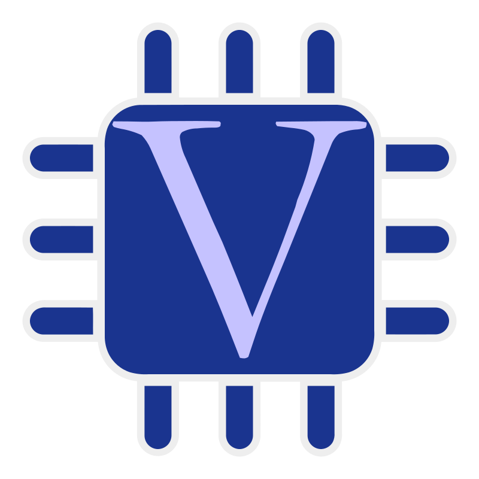
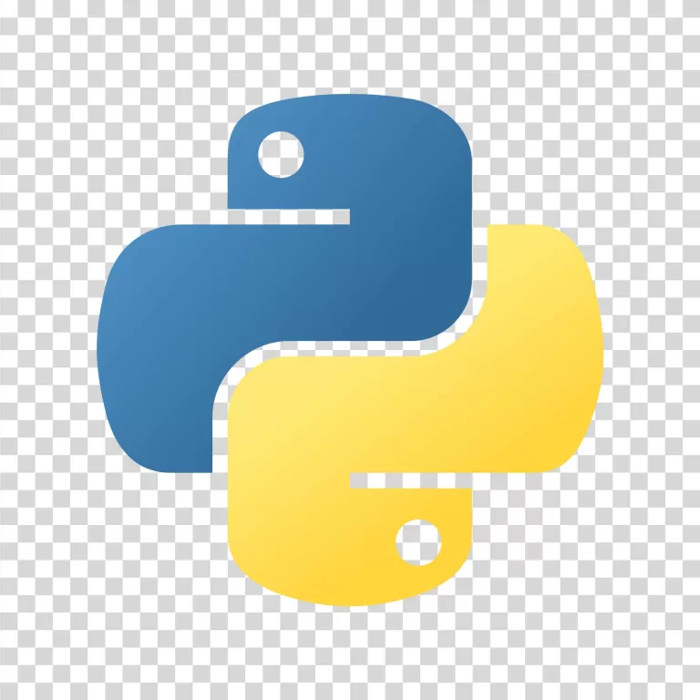
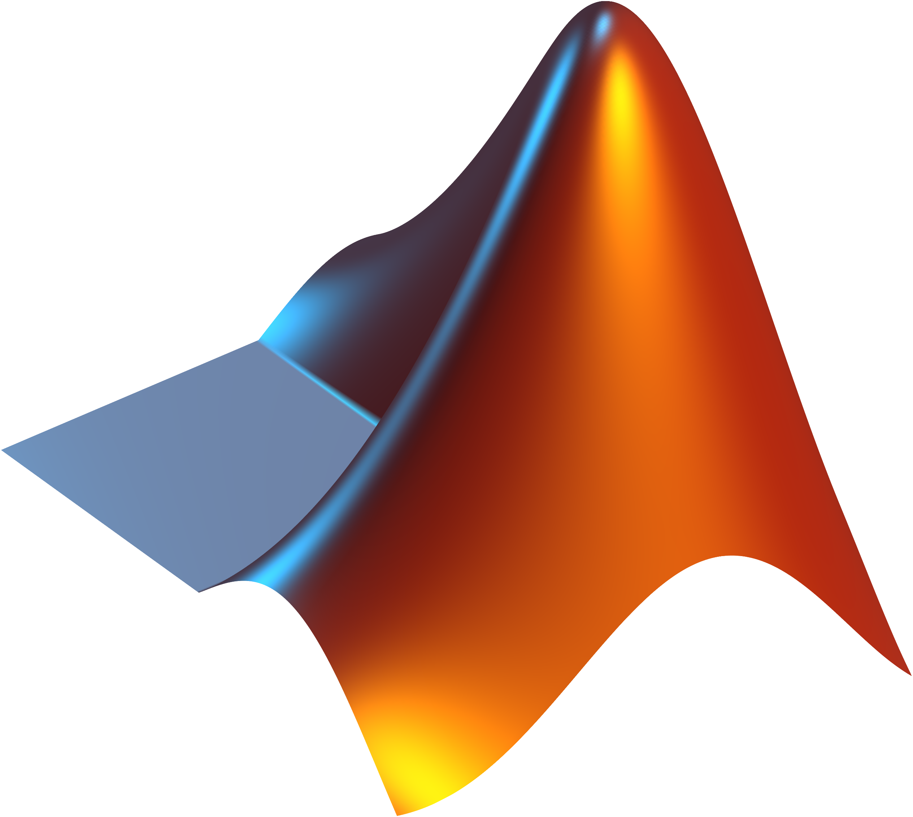
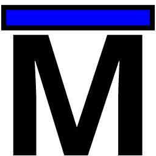

# Hi 👋, I'm Vincent57999

### A Digital IC Student from Taiwan

---

### Languages and Tools

  
  &nbsp;&nbsp;
  
  &nbsp;&nbsp;
  
  &nbsp;&nbsp;
  
  &nbsp;&nbsp;
  

 

### Most Used Languages

